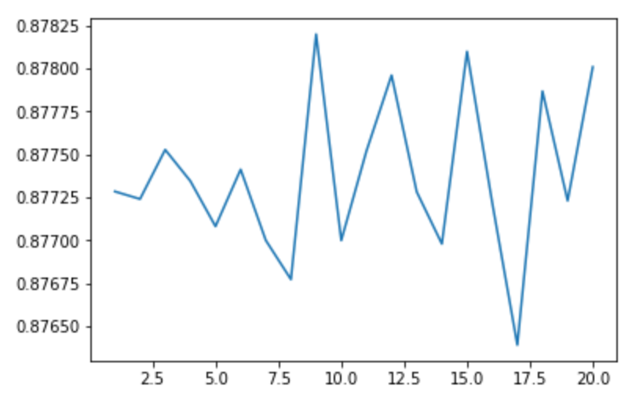
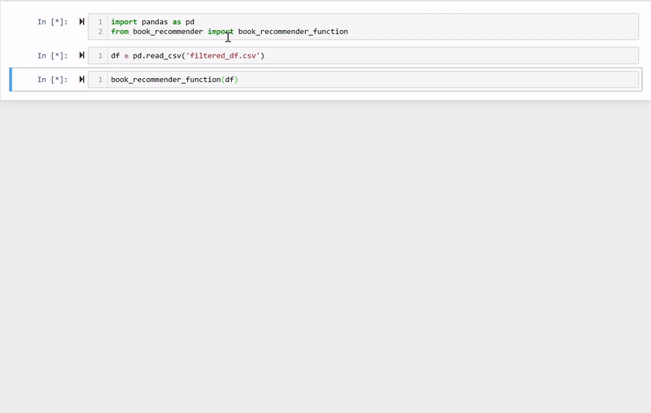

# DS-Mod-4-Project
Recommending books based on reviews out of five stars scraped from [Good Reads' Best Books of 2018](https://www.goodreads.com/choiceawards/best-books-2018).

## Overall Findings
* Singular value decomposition algorithm performed best yielding a root mean squared error of 0.877 stars and a mean absolute error 0.682 stars
* Model building was relatively basic, and with more time would experiment with adding more features to it.
    * Only a limited number of reviews were scraped and each review had a number of likes that could have been used to weigh the most liked reviews more

## Methodology - Gathering, Cleaning and Filtering the Data
* Initially scraped each book's page for its title, author, url and other basic info
    * Used this as a dictionary of sorts to then scrape each book page's reviews
    * Approximately 500 books were taken with each title having up to 300 reviews
    * After removing duplicates, final dataset had 113,248 rows
* Book info dataframe and review dataframe were combined. The SVD model through the Surprise library can only take the user review score, user id and isbn, but features scraped besides those included the name of the user, book title and author, number of likes for each review, and aggregate metrics like overall average review score, total number of reviews and ratings
* There were duplicate books that were scraped and final dataset had reviewed for 395 different books
* Data was filtered to only included users that had reviewed at least 5 books. Fortunately there were 3,772 people that met this criteria, even though they only accounted for 6.04% of total accounts with total reviews (rows) totalling 35,913
* Below are distributions of review counts by user before and after filtering
 

## Model Building
* Began by using a baseline SVD model without passing in any hyperparameters. RMSE was 0.889 stars
* Using randomized search and manual visualizations of hyperparameters, we were able to decrease the RMSE to 0.877 and MAE to 0.682. Below is an example of one of these visualizations, this one being the number of factors vs. RMSE

* Various K Nearest Neighbors algorithms built into Surpise were also tested, but all performed significantly worse than SVD

## Creating the Recommender
* Many different functions were created, not all of which used the machine learning model built above, but all used the data in some way shape or form.
* The most important aspect was that the user was able to review between one and ten books on a scale of one to five stars, their reviews were then added to the data, the model using the best hyperparameters was refit and between one and ten recommendations was returned 
* Ultimately the recommendation system included an ability to create a username, checked if an author was in Good Reads' Best Books of 2018, allowed the user to review between one and ten movies, be given between one and ten recommendations and start the process over if they chose.
* Below is the recommender in action!

## Next Steps
* Since the final model still had a somewhat large margin of error, we would figure out how to add more complexity to the model.
    * This would include scraping the actual text of the reviews and running a sentiment analysis on them using a library like TextBlob as well as using the number of votes each review got as a weight
* Additionally, Good Reads limits the reviews users can see to 300, but if we found a way to get more, having more than just a few hundred reviews for each title could help with accuracy, but the one to five star rating scale is somewhat limited in precision
* We would also expand the data to scrape more books and their reviews, as well as possibly including more qualitative data like genre
* Experimenting with other machine learning algorithms both witin the Surprise library and perhaps other libraries to see if we could find something to imporve our accuracy even more
* In the recommender we might have added more functions so there would be other information the user could request like average overall review score
